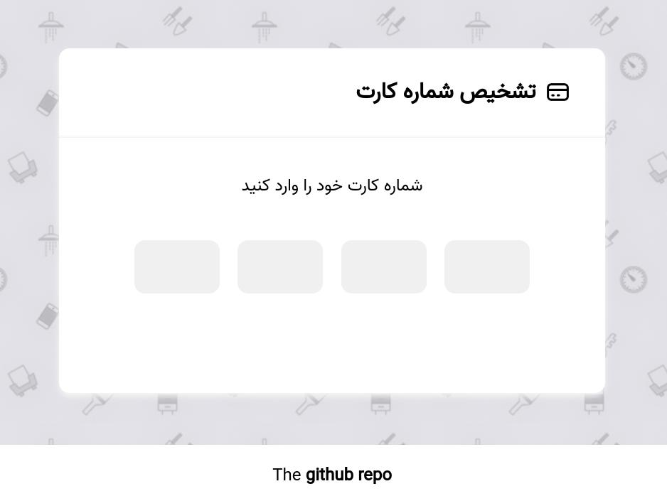

# Detect Iranian Bank Web

یک سایت که یک یا چند فیلد برای وارد کردن کد بانکی داره و کد بانکی رو شناسایی می کند که از چه بانک و مشخصاتی است.

در صورتی که شماره کارت در چهار فیلد مجزا قرار بگیرد باید به خوبی event ها کنترل شود تا کلید هایی مثل backspace کار کند و اگر چهار رقم پر شد خودکار در فیلد بعدی فوکوس شود.
## Authors

- nafasebra
- basemax

© Copyright 2022, Max Base
